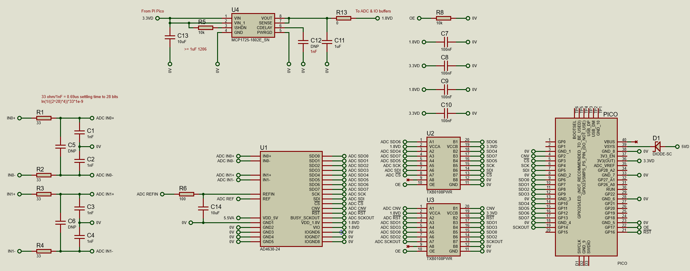
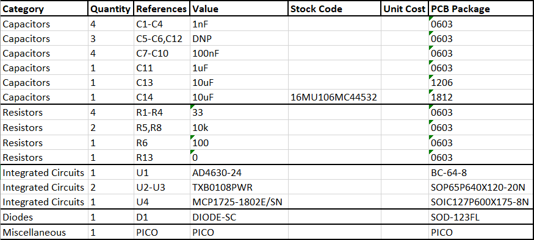

# ad4630-pico-breakout

Breakout board for AD4630 ADC and Pi Pico.

## Soldering procedure

No solder paste/stencil required, add tack flux (SMD291ST2CC6) to BGA pads, place AD4630 (no other components) and reflow with hot plate. Place a bit of leadfree solder wire near the BGA as a visual guide as it turns into a solder blob when temperature is high enough, and tap the top of the BGA gently (too hard can cause shorts) when at peak temperature to ensure all balls are seated before starting cooldown. Solder the rest of the parts manually with soldering iron. Clean board with IPA.

## Board render

## Populated board

Shows old version with deadbugging around IO translators. New version in this repository has fixed these errors.

## Schematic

## BOM

C1-C4 should be C0G. R6 was populated as 470 ohm.

